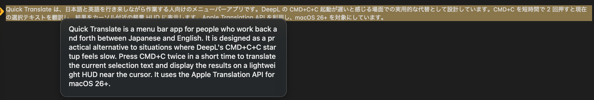

# Quick Translate for macOS ⚡ - CMD+C+C で即時 HUD 翻訳
[English](README.md) | [日本語](README.ja.md)

Quick Translate は、日本語と英語を行き来しながら作業する人向けのメニューバーアプリです。DeepL の `CMD+C+C` 起動が遅いと感じる場面での実用的な代替として設計しています。`CMD+C` を短時間で 2 回押すと現在の選択テキストを翻訳し、結果をカーソル付近の軽量 HUD に表示します。Apple Translation API を利用し、`macOS 26+` を対象にしています。



## Install

### Requirements
- macOS 26.0 以降。
- `システム設定 > 一般 > 言語と地域 > 翻訳言語` に Apple の翻訳モデルがインストール済みであること。
- グローバルショートカット検知のためにアクセシビリティ権限が有効であること。

### Package manager
```bash
brew install gawasa29/tap/quick-translate
```

### Build from source
```bash
git clone https://github.com/gawasa29/macos-quick-translate.git
cd macos-quick-translate
./scripts/install.sh --open
```

## Quick Start

1. アプリをインストールして `Quick Translate` を起動します。
2. プロンプトが表示されたらアクセシビリティ権限を許可します。
3. メニューの `Target Language` から翻訳先言語を選択します。
4. 任意のアプリでテキストを選択し、`CMD+C` を短時間で 2 回押します。
5. 翻訳結果が HUD に表示されることを確認します。
6. 翻訳に失敗する場合は、メニューの `Open Translation Settings` を開いて必要な言語モデルをインストールします。

```bash
./scripts/install.sh --help
```

## Features

- Dock ウィンドウを持たないメニューバー中心のワークフロー。
- DeepL の `CMD+C+C` 起動が遅いときの実用的な代替というポジション。
- グローバルキー監視とペーストボード監視の両方による `CMD+C+C` トリガー検知。
- Apple Translation の対応言語から構成される翻訳先言語ピッカー。
- クリップボードを上書きせず、翻訳結果を HUD で表示。
- ユーザー LaunchAgent ベースの `Launch at Login` 切り替え。
- UI 変更前に翻訳コアを検証できる CLI（`quick-translate-cli`）。

## Docs

- [Project policy and run commands](AGENTS.md)
- [Menu bar app entry point](Sources/quick-translate-macos/main.swift)
- [CLI entry point](Sources/quick-translate-cli/main.swift)
- [Core translation contracts](Sources/QuickTranslateCore/Translator.swift)
- [Packaging scripts](scripts/)

## Privacy / Permissions / Limitations

### Privacy
- DeepL は使用せず、`DEEPL_API_KEY` も不要です。
- アプリは翻訳履歴を永続化しません。
- クリップボードの読み取りは `CMD+C+C` トリガー時のみ行います。

### Permissions
- グローバルショートカット検知のためにアクセシビリティ権限が必要です。
- Launch at Login を有効にすると `~/Library/LaunchAgents/dev.gawasa.quick-translate-macos.plist` を作成します。

### Limitations
- 翻訳には `macOS 26+` と Apple 翻訳モデルのインストールが必要です。
- ショートカットは `CMD+C+C` 固定です。
- 利用可能な翻訳先言語は Apple Translation framework の対応状況に依存します。

## Getting started (dev)

```bash
swift build
swift test
swift run quick-translate-cli "Hello" JA
swift run quick-translate-macos
```

## Build app bundle

```bash
./scripts/create-app-bundle.sh --output-dir out
./scripts/install.sh --open
```

## Uninstall

```bash
brew uninstall quick-translate
./scripts/uninstall.sh
```

## Release

```bash
./scripts/create-app-bundle.sh --configuration release --output-dir out --version <version> --build-number <build-number>
./scripts/render-homebrew-cask.sh --version <version> --sha256 <sha256> --url <asset-url>
```

公開配布時は Developer ID 署名と notarization を実施してください。

## Related

- [Homebrew Tap (`gawasa29/tap`)](https://github.com/gawasa29/homebrew-tap) - Cask 配布チャネル。

## License

MIT License. [`LICENSE`](LICENSE) を参照してください。
